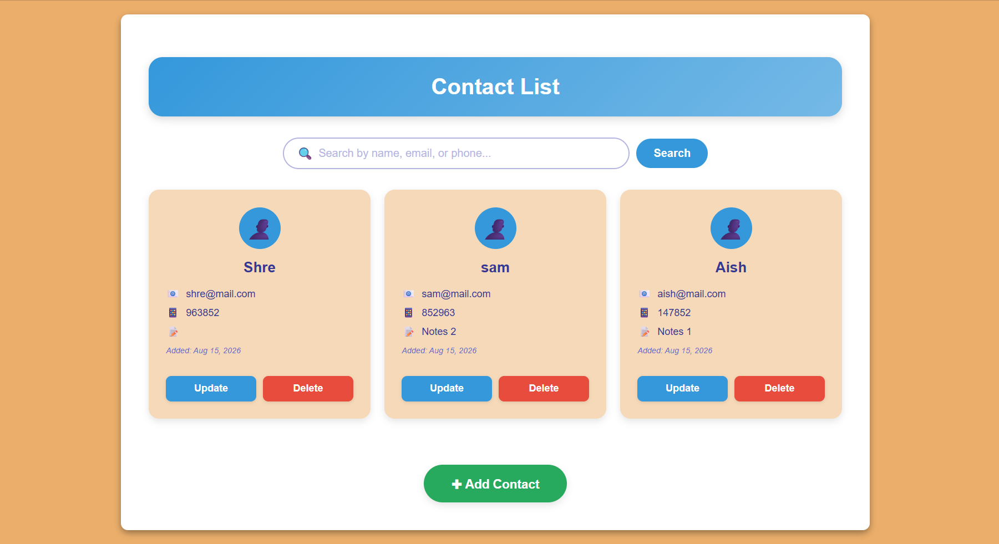
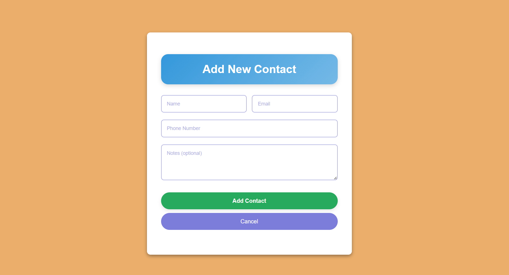
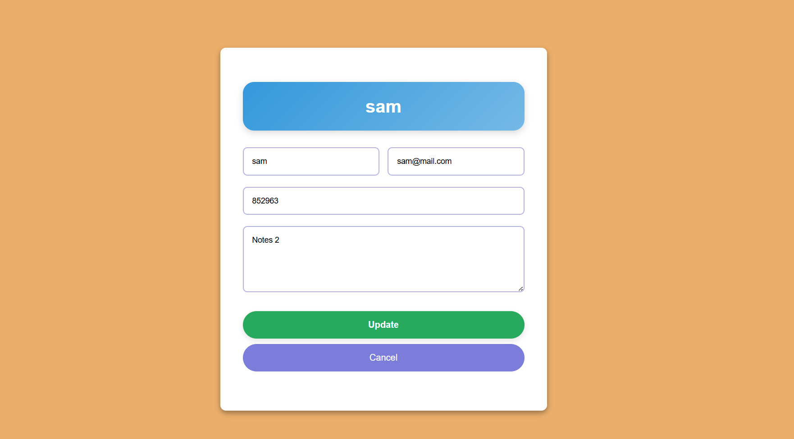

# Contacts Manager (Flask CRUD App)

A full-stack CRUD web application for managing contacts, built with **Flask**, **SQLAlchemy**, **SQLite**, **Jinja2**, and **SCSS**. The project implements contact management, search, validation, and session-based user data isolation.  
This project helped me practice full **CRUD operations**, basic **search functionality**, session-based user separation, and frontend styling with SCSS.

---

## Features

- Create, view, update, and delete contacts
- Search contacts by **name, email, or phone number**
- Session-based contact isolation (contacts are associated with a browser session)
- Styled UI using **SCSS**
- Flash messages for validation and errors
- Responsive, card-based contact layout

---
## Screenshots

### Contact List


### Add Contact


### Update Contact


---

## Tech Stack

- **Backend:** Flask, SQLAlchemy
- **Frontend:** HTML, Jinja2, SCSS
- **Database:** SQLite
- **Styling:** SCSS (compiled to CSS)
- **Sessions:** Flask session with UUID-based user IDs

---

## Project Structure
```
contacts-manager/
├── app.py                 # Main Flask application
├── requirements.txt       # Python dependencies
├── README.md              # Project documentation
├── .gitignore             # Ignored files (venv, db, compiled CSS)
│
├── templates/             # Jinja2 HTML templates
│   ├── index.html         # Contact list + search
│   ├── add.html           # Add new contact form
│   └── update.html        # Update contact form
|   └── base.html
│
├── static/                # Static assets
│   └── styles.scss        # SCSS source file (compiled locally)
│
├── screenshots/
│   ├── contact-list.png
│   ├── add-contact.png
│   └── update-contact.png
|
└── venv/                  # Virtual environment (ignored)

```
---

## Setup & Installation

## How to Run

Clone the repository

git clone https://github.com/Mohd-Afzaal/contacts-manager.git
cd contacts-manager


Create & activate virtual environment (recommended)

Windows
```bash
python -m venv venv
venv\Scripts\activate
```

Linux / macOS
```bash
python -m venv venv
source venv/bin/activate
```

Install dependencies
```bash
pip install -r requirements.txt
```

Run the app
```bash
python app.py
```

Open your browser
```
http://127.0.0.1:5000/
```

SCSS Compilation

Styles are written in SCSS and must be compiled before they appear.

Compile once
```bash
sass static/styles.scss static/styles.css
```

Auto-compile during development
```bash
sass --watch static:static
```

⚠️ Compiled CSS files are ignored in Git.
Make sure the watcher is running while developing.

## What I Learned

- Building CRUD applications with Flask
- Working with SQLAlchemy ORM
- Managing SQLite databases
- Handling form validation and database errors
- Using Flask sessions to separate user data
- Implementing search functionality
- Structuring Flask templates with Jinja2
- Styling a Flask application using SCSS

## License
This project is licensed under the MIT License.

## Author

Mohd Afzaal

Learning Flask by building real projects instead of tutorials.

